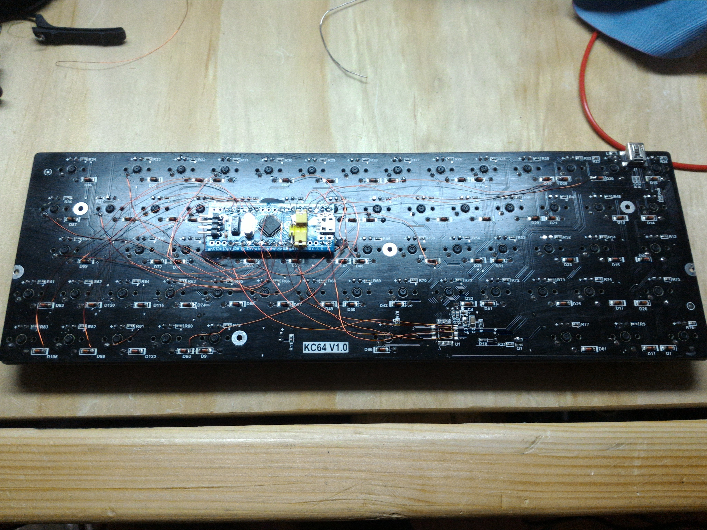
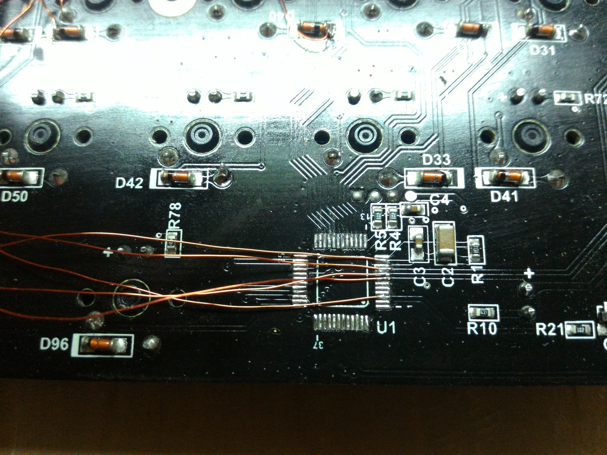
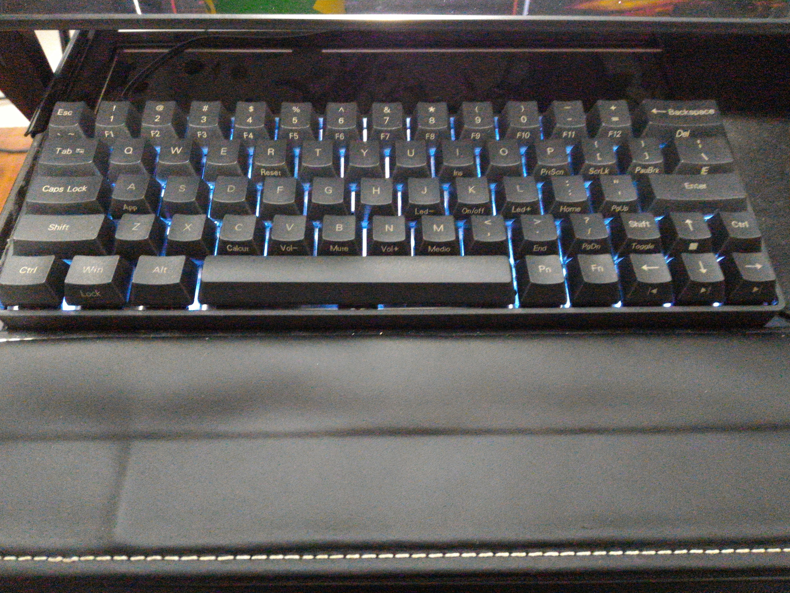

# KC64 Mod for QMK Firmware

##Background
The KC64 keyboard is a 60% keyboard that comes in a variety of mechanical switch flavors. Furthermore, the keyboard has backlighting and PBT keycaps. Unfortunately, the first version of the keyboard was plagued by usability issues typically experienced as missing keystrokes if one typed too quickly, this issue was widely reported by users on a [Massdrop discussion forum](https://www.massdrop.com/buy/kc64-mechanical-keyboard/talk). Although the EFM8UB2 microcontroller that the keyboard came with is potentially re-flashable, at the time of this writing no open-source keyboard firmware exists targetting this particular microcontroller.

##Modding the Keyboard
A relatively low cost solution is to remove the EFM8UB2 microcontroller and instead use a microcontroller that is supported by the popular QMK Firmware. For this project I decided to use the popular "Blue Pill" Board that contains an STM32F103C8T6 microcontroller due to it's low cost and ready availability. The next step was to trace the key switches, diodes, and led control to their pads on the EFM8UB2 microcontroller, my results are documented in [pins_kc64.txt](pins_kc64.txt). I attached the blue pill board to the back of keyboard using hot glue and while being careful to avoid contact between any pins of the keyboard and the blue pill. I also chose a location that would allow the board to re-assemble into it's housing without modification. The following step was to solder the connections between the keyboard and the blue pill board using 32 AWG enamled copper wire, it is important that the insulation be of solderable polyurethane; I used Elektrisola PN155 32 AWG wire. The point to point connections are listed in [bluepill_kc64.txt][bluepill_kc64.txt]. I then modified the [chibios_test](../keyboards/chibios_test) keyboard to work with the pin configuration. The [keymap](../keyboards/chibios_test/keymaps/default/keymap.c) reflects my personal preference, the function keys in particular do not correspond with the original KC64 configuration. Also I have shuffled around the right CTRL, PN, and FN keys. I flashed the [firmware](chibios_test_stm32_f103_onekey_default.hex) using an STLINK from a nucleo board.

##Pictures

